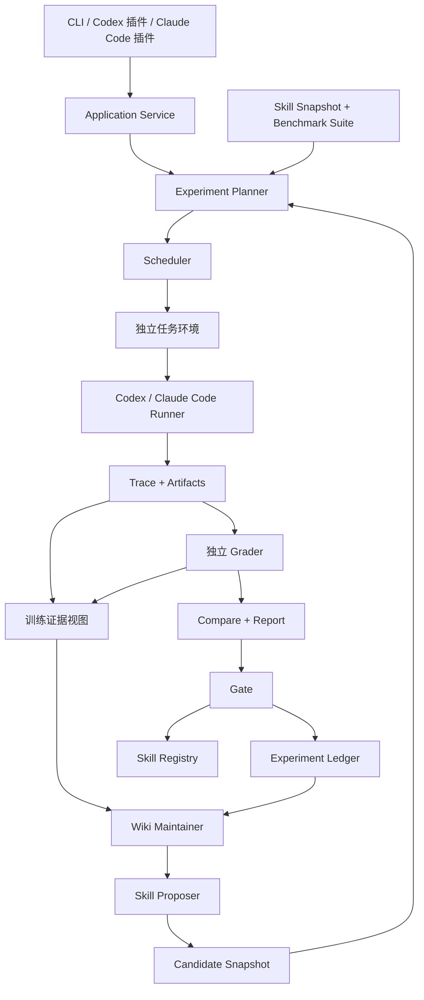

# 项目架构 v0.1

状态：设计提案。用户已明确的目标是跨平台测评 Skill，并用评测结果推动迭代；技术选型与具体边界是本草案的建议。

后续产品入口与工程架构见[本地可视化工作台架构](local-workbench-architecture.md)：本地网页和本机 Agent 发现的第一条竖切片已经实现，实时事件、执行监督与 Skill 版本管理继续按该架构推进。本页保留 v0.1 设计背景；其中“静态报告优先”等交付选择由新架构更新，评测隔离与证据原则继续适用。

## 1. 产品边界

主要用户是 Skill 作者、维护者和评测人员。输入是一个现有 Skill 包及其任务集；输出是效果报告、失败证据、候选修改和版本决策。日常运行日志可以作为补充样例来源。

用户可以在 Codex 中启动实验、让 Claude Code 执行被测任务，再回到 Codex 查看报告。因此必须区分：

| 概念 | 职责 |
| --- | --- |
| 操作入口 Host | 用户在哪个终端或 Agent 平台发起测评 |
| 被测执行器 Runner | 真正加载目标 Skill、执行每道题的 Agent |
| 评分器 Grader | 根据产物和外部证据判断任务完成情况 |
| 迭代器 Optimizer | 分析训练失败、维护 Wiki、提出 Skill 修改 |

这四者可以使用不同模型。Host 的当前对话、知识库和管理 Skill 不进入被测任务的上下文。

## 2. 总体结构



图中 Ledger 向 Wiki 开放的是训练证据和开发期验证摘要；最终测试集的题目、轨迹与逐题结果不进入演化视图。

## 3. 模块职责与依赖

| 模块 | 输入 → 输出 | 责任边界 |
| --- | --- | --- |
| Skill Catalog | 原始目录 → 内容快照 | 校验、依赖清单、哈希、版本；不修改导入源 |
| Suite Catalog | 任务与评分规则 → Suite 快照 | 划分数据、检查重叠、提供任务环境和评分器 |
| Planner | 实验配置 → RunPlan | 展开对照矩阵、预算、随机顺序、可比性检查 |
| Scheduler | RunPlan → Trials | 调度、限流、超时、重试、中断恢复 |
| Runtime | TrialSpec → 事件与产物 | 由 EnvironmentBackend 和 RunnerAdapter 配合执行 |
| Evaluator | 冻结产物 → 逐题评分与比较 | 独立评分、置信区间、回归、报告与门禁 |
| Evolution | 训练证据与历史 → Wiki/Proposal | 形成假设与候选；无权改评分器、验证任务或发布指针 |
| Registry/Storage | 快照与决策 → 可追溯版本 | 版本状态、追加记录、内容寻址、导出与回滚 |

依赖方向：入口 → Application Service → 用例与契约 → 外部实现。领域契约不依赖 Codex、Claude SDK、数据库驱动或 MCP。跨进程通信从需要时再增加。

## 4. 插件交付形态

插件提供少量管理工作流，例如“评测这个 Skill”“解释失败”“提出改进”。它把任务提交到 Application Service，取得 Run ID，随后查询进度和报告。

三种入口复用同一组操作：

- CLI：脚本和 CI 直接调用核心。
- 平台插件：打包管理 Skill、平台清单以及 CLI/MCP 连接配置。
- 可选 MCP：暴露提交、查询、比较、生成候选、发布和导出接口；用于宿主不便直接调用 CLI 的场景。

MCP 是调用入口，不自带批量调度、全量日志捕获或平台启动能力。这些由本地核心与执行器承担。测评插件不安装到被测环境；被测环境只包含目标 Skill 和冻结的公共配置。

## 5. 执行环境是实验的一部分

一个 Trial 使用独立会话、独立工作目录和固定任务快照。每个实验条件都从相同初始状态启动。

需要隔离的内容包括用户级 Skill、自动记忆、项目规则、其他插件、MCP 配置、缓存和先前任务文件。仅新建目录或 Git worktree 不能证明这些都已隔离。

EnvironmentBackend 管理整个任务边界。正式成绩要求经验证的隔离 Worker：可以是容器或 VM；具体运行器、认证和平台版本的组合要通过一致性测试。原生本地进程用于适配调试；隔离证据不足时，报告标为 exploratory，禁止自动发布依据。

任务 Agent 仅访问公开输入和它自己的工作区。完成后冻结产物，独立评分环境读取隐藏测试和冻结产物。具有 Shell 能力的被测 Agent 无法通过“另一个目录”被可靠限制，因此隐藏评分器和控制数据库不能挂载到它的执行环境。

网络按 Suite 固定：无网络、固定回放数据或实时网络。实时网络实验记录执行窗口，不能与固定回放实验混为同一比较组。模型服务访问与任务工具网络分别配置。

## 6. WikiSkill 机制的产品化

保留论文中的三层：观测轨迹、积累知识、可执行 Skill。扩展为：

1. Raw：保存经采集策略处理后封存的事件与产物；秘密信息先过滤，不保存隐藏思维链。
2. Wiki：按 Skill/任务族/环境记录失败与成功模式；每个结论关联证据，区分观察、假设和已验证结果。
3. Skill：不可变快照及基于父版本的 diff，包含说明文件和所有资源。

候选未通过时保留 Wiki 和实验记录，但标记被反驳的假设；“Wiki 不回滚”不意味着错误结论永远有效。Wiki 用快照保留历史，当前索引可以合并、废弃或替换条目。

评测自身独立于演化。用户可以只导入、运行、比较，不启动任何自动改写。一次迭代始终冻结评分器、任务、工具和预算；修改这些内容必须创建新的实验定义。

Wiki Maintainer 与 Proposer 通过独立 AnalysisBackend 调用模型。第一版可使用已配置的 Codex/Claude CLI 创建新的分析会话；后续可接模型 API。分析会话只拿到训练 EvidenceView、开发决策摘要和候选输出区，不能继承已经展示过最终测试报告的宿主上下文。它与被测 Runner 可复用底层进程通信代码，但使用不同输入、权限和结果类型。

## 7. 存储与持久性

建议本地 SQLite 保存索引和作业状态，文件系统保存大对象。Wiki 用 Markdown 呈现，机器读取的是带版本的结构化记录；Markdown 是可重建视图。

```text
<用户选择的 SkillLab 数据目录>/
├── metadata.sqlite
├── objects/sha256/             # Skill、任务、产物、报告等不可变对象
├── runs/<run-id>/              # manifest、事件、评分、比较结果
├── wiki/<skill-id>/            # pattern 视图与历史索引
├── proposals/<proposal-id>/    # 假设、diff、父版本、证据
├── reports/<run-id>/           # HTML / Markdown
└── work/<trial-id>/            # 临时任务目录或环境元数据
```

隐藏数据放在评分 Worker 专用存储，不能因为与公开题目一起打包而被挂载。对象哈希用于完整性与去重，不等于访问控制。

提交产物时先写临时对象，校验哈希后原子提交，再更新数据库索引。崩溃后可以发现未引用对象或缺失对象；不把缺失产物标为成功。运行中断后保留完成的 Trial，只调度未完成计划项。

## 8. 拟定代码布局

```text
apps/
  cli/                        # 用户命令
  mcp-server/                 # 可选插件桥接入口
packages/
  contracts/                 # JSON Schema、类型、版本迁移
  application/               # 导入、计划、运行、比较、迭代用例
  runner/                    # 调度与 RunnerAdapter 契约
  adapters-codex/
  adapters-claude-code/
  environments/              # 容器/VM Worker 与本地调试后端
  evaluation/                # 评分、统计、门禁
  evolution/                 # Wiki、假设、候选生成
  storage/                   # SQLite + 对象存储 + Registry
  reporting/                 # 静态报告
plugins/
  codex/                     # 平台包：管理 Skill + 清单
  claude-code/
suites/                      # 演示任务包；不是核心业务代码
tests/
  adapter-conformance/
  integration/
docs/
```

这些是模块边界，第一版可以在一个进程内运行；不要求每个目录成为独立服务或单独发布的依赖包。

## 9. 技术决策草案

| 决策 | 建议与理由 | 代价 / 备选 |
| --- | --- | --- |
| 核心语言 | TypeScript，统一 CLI、事件契约、插件桥接 | Python 更方便统计；复杂统计和领域评分允许独立程序 |
| 部署 | 本地核心 + 隔离 Worker | 云端集中调度适合团队，放后续版本 |
| 接入 | 先使用官方 CLI 的机器可读输出 | SDK 后续可替换；解析器需锁定并测试平台版本 |
| 数据 | SQLite + 内容寻址文件 | 多机器协作时替换为服务端数据库和对象存储 |
| 评分器 | 版本化独立进程，JSON 输入/输出 | 比全放核心里稍复杂，换来语言和领域扩展能力 |
| 展示 | 静态 HTML + JSON/Markdown | 先让证据完整，交互式实验台后续增加 |
| 发布 | 注册表版本与平台导出分开 | 多一步显式操作，但实验版本不会意外覆盖正在用的 Skill |

以上均为拟定选型。设计不绑定模型名称、API 定价或尚未验证的平台能力。下一步开发顺序见[实施计划](implementation-plan.md)。
