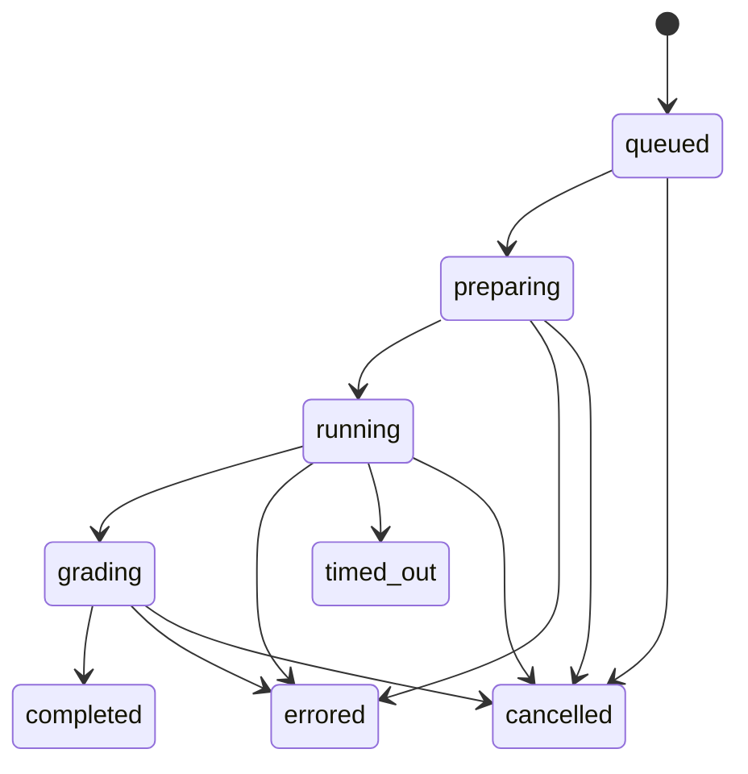

# 数据与接口契约

状态：v0.1 协议与首版实现同步。核心类型和 Skill、Suite、Trial、Grade、Comparison、RunPlan、环境、Evidence、Proposal、Gate、Release、RunnerProfile JSON Schema 已实现；后续兼容字段需提升协议版本并保留历史证据。

下一阶段的 Workspace、SkillVersion、Condition 版本绑定、Attempt、实时事件游标与 HTTP API 见[本地可视化工作台架构](local-workbench-architecture.md)。Workspace、Agent、Skill、Suite、Plan、Run 与每 Skill 发布视图已形成首版本地 HTTP API；Plan 保存精确的 Condition → SkillVersion 绑定及请求模型，模型同时进入 RunnerProfile、配置摘要和比较指纹。`version-comparison` 计划要求 incumbent 与 candidate 来自同一 Skill 的两个不同不可变版本，并冻结 `none / incumbent / candidate` 三组条件；执行时分别物化绑定版本，不能让两个条件共享可变源目录。Run 保存状态、Trial 进度、受限的实时事件窗口及最终报告，并支持取消；详情读取最终报告中的条件汇总、逐题 ExecutionReceipt、Grade、TraceEvent、输出产物和 GateDecision，缺失字段不由 UI 补造。工作台已能通过现有 `GET /runs/:id` 同时读取两份已完成报告，按 Trial 身份配对并生成可重建的历史对比视图。发布接口只接受完成的 `version-comparison` Run，要求结果覆盖冻结 Trial 矩阵、Plan/Suite/候选摘要匹配，并用原政策重算 Gate 为 accept；Release 绑定 Run ID 与 Decision ID。每个 Skill 使用独立 current 指针和 `expectedCurrentDigest` 乐观锁，回滚追加事件；平台导出路径由服务生成在 Workspace 的 `.skillbenchmark/exports/` 中，不接受浏览器提供任意写入路径。比较要求 Suite 摘要、Agent/请求模型、Runner 配置摘要、条件、重复次数、预算、执行模式和加载方式一致才能作严格解释；否则只是描述性观察。独立跨 Run Comparison 资源、Attempt 资源、平台实际模型收据、持久化 Export 索引和游标式事件补流仍待版本化实现。本页下述目标字段/接口并非全部等同于现有 TypeScript 实现，实际差距与迁移要求列于新架构第 12 节。实现时应版本化迁移，不能给旧记录补造缺失证据。

ExecutionReceipt 现可保存 `platform_receipt.requested_model/reported_model/session_id` 和平台报告的 token/费用；旧记录或平台未报告字段保持 unknown，不回填推断值。`POST /agents/:id/verify` 创建持久化连接验证，`GET /agent-verifications/:id` 查询终态，`GET /agents` 附带最近一次验证。连接验证只改变认证证据，不会单独把评测能力升级为 verified。

Agent API 同时返回逐项 `capabilityMatrix`。每项包含稳定 ID、状态、证据来源、观测时间和解释；状态区分 `verified / exploratory / not-reported / unsupported`，来源区分 `discovery / connection / adapter-conformance`。`not-reported` 表示平台在该次成功调用中没有给出字段，不等于零值或不支持；Adapter 自动测试证据也不能冒充当前本机 CLI 的真实验证。

## 1. 通用规则

- 所有记录带 `schema_version`；不兼容字段变化提升主版本，不静默迁移历史证据。
- 名称与版本是标签，真实实验身份使用 `sha256` 内容摘要。
- 时间使用 UTC；毫秒、Token、比例和货币单位明确；缺失值用 null 并说明原因。
- URI 指向受控对象存储，不接受任意文件路径作为评分器或执行器的读写授权。
- 运行前把可变配置解析为不可变 RunPlan；开始后修改配置产生新 Run。

## 2. 领域对象

| 对象 | 必要字段 | 说明 |
| --- | --- | --- |
| SkillSnapshot | skill_id, label, tree_digest, file_manifest, requirements | 整个 Skill 包，不仅是 SKILL.md |
| Task | task_id, family_id, source_group, split, input_ref, fixture_ref, grader_ref, tags | 公开输入与隐藏评分资料分离 |
| SuiteSnapshot | suite_id, digest, task_manifest, split_policy, metric_policy, graders | 任务集合和评分政策不可变 |
| RunnerProfile | platform, platform_version, adapter_version, model, config_digest, capabilities | 某个平台/模型/配置组合 |
| EnvironmentSnapshot | backend, image_digest, tool_versions, network_policy, isolation_receipt | 实际环境和可访问资源证据 |
| RunPlan | run_id, suite, profiles, conditions, repeats, budget, schedule, policy, fingerprint | 展开的完整实验计划 |
| TrialSpec | trial_id, run_id, task_id, profile_id, condition_id, repeat_index, attempt | 一个计划项的一次实际尝试 |
| TraceEvent | event_id, trial_id, seq, kind, producer, timestamp, payload_ref | 可观测执行事件 |
| Grade | trial_id, grader_digest, outcome, metrics, assertions, evidence_refs | 独立评分结果 |
| Comparison | run_id, contrast, strata, effect, interval, regressions, missingness | 同一可比组内的对照结果 |
| WikiPattern | pattern_id, revision, scope, observations, hypotheses, evidence, status | 知识条目；不把分析当事实 |
| Proposal | proposal_id, parent_digest, candidate_digest, diff_ref, hypothesis, evidence_refs | 一次可验证修改 |
| GateDecision | decision_id, comparison_ref, policy_digest, status, reasons | 确定性门禁结果 |
| Release | skill_digest, evaluation_refs, scope, audit_status, timestamp | 发布记录与运行环境适用范围 |

### SkillSnapshot 哈希

对根目录内相对路径、原始文件字节和可执行标志生成排序后的清单并求摘要；不包含修改时间和本机绝对路径。外部符号链接拒绝导入，内部链接在快照时规范化并记入清单。大小写冲突等跨系统路径问题在导入期诊断。

`requirements` 记录工具、语言运行时、外部资源和环境假设。依赖可以在 Skill 元数据或评测 sidecar 中声明；评测元数据不注入模型。外部可变依赖应固定版本或摘要，无法固定时报告限制。

### 比较指纹

`fingerprint` 排除目标 Skill 的实验条件，包含 Suite、评分器、平台/模型配置、公共指令、工具、环境、预算、加载方法、背景 Skill 集合、调度政策和统计政策。只有指纹一致的条件才能直接计算迭代增益。

一个多 Profile RunPlan 保存各 Profile 的比较指纹映射。跨 Profile 对比由单独的分层 Comparison 完成；不强行把不同模型合并成同一个指纹。完整 RunPlan 的摘要还包含各条件的 Skill 摘要。

### 预算字段

`max_trials` 限制展开后的计划项数，`max_attempts` 限制包含基础设施重试在内的实际启动次数，`timeout_ms` 限制单次尝试，`max_duration_ms`（由新计划写入，旧计划缺失时按 Trial 数量回退）限制整个异步 Run 的墙钟时间。Runner 和 Grader 的 stdout/stderr 捕获也有固定上限，超过上限即终止该进程。超额前停止调度，已经完成的证据保留，未完成矩阵不能发布。Optimizer 也有独立预算并汇总到 Evolution Session，不隐藏在 Trial 成本之外。

## 3. 应用接口

下列接口是拟定本地服务操作，CLI 和 MCP 映射至同一实现：

| 操作 | 输入 | 输出 |
| --- | --- | --- |
| importSkill | 显式源目录、导入政策 | SkillSnapshot + 诊断 |
| importSuite | Suite 包、数据来源信息 | SuiteSnapshot + 切分诊断 |
| planExperiment | 快照引用、矩阵、预算、评分政策 | RunPlan + 尝试数/预算上界 |
| submitExperiment | 已校验 RunPlan、idempotency_key | Run ID |
| getRun / cancelRun | Run ID | 状态 / 取消受理结果 |
| compareRun | Run ID、预定义 contrasts | Comparison + GateDecision |
| evolve | incumbent、训练证据视图、策略和预算 | Evolution Session ID |
| getProposal | Proposal ID | 假设、diff、证据、测评结果 |
| publishRelease | 合格候选、评估引用、expected_current_digest | Release |
| exportRelease | Release、目标平台、显式目标目录 | 导出收据 |
| rollbackRelease | 旧 Release、expected_current_digest | 新的发布指针事件 |

长任务返回 ID，不占用宿主 Agent 的整段对话。查询增量进度使用 cursor。重复提交同一个 idempotency_key 返回原 Run；相同 key 对应不同计划则拒绝。

外部模型调用不具备端到端 exactly-once 保证。Worker 丢失时记录未知完成状态、已有事件和可能已发生的费用，再按重试政策处理，不能假装那次调用没有发生。

## 4. Runner 与环境接口

```typescript
interface RunnerAdapter {
  probe(request: ProbeRequest): Promise<CapabilityReport>;
  prepare(spec: TrialSpec, env: EnvironmentHandle): Promise<PreparedTrial>;
  execute(trial: PreparedTrial, signal: AbortSignal): AsyncIterable<TraceEvent>;
  finalize(trial: PreparedTrial): Promise<ExecutionReceipt>;
  dispose(trial: PreparedTrial): Promise<void>;
}

interface EnvironmentBackend {
  provision(spec: EnvironmentSpec): Promise<EnvironmentHandle>;
  collect(handle: EnvironmentHandle): Promise<ArtifactManifest>;
  destroy(handle: EnvironmentHandle): Promise<void>;
}

interface Grader {
  grade(input: GradeInput): Promise<Grade>;
}

interface AnalysisBackend {
  analyze(request: AnalysisRequest, signal: AbortSignal): Promise<AnalysisResult>;
}
```

`ProbeRequest` 指定平台二进制和所需能力；`CapabilityReport` 返回 supported / unsupported / unverified 及证据。`PreparedTrial` 包含实际 argv、配置摘要、环境句柄和加载计划。`ExecutionReceipt` 保存终态、实际模型、预算、注入收据及产物引用，不包含凭证。

`GradeInput` 只含任务评分材料和冻结产物，不含条件标签。环境的创建与销毁属于 Backend；Adapter 处理平台调用，不自己管理全局 Wiki 或数据库。

`AnalysisRequest` 指定 Wiki 整理或候选生成角色、过滤后的 EvidenceView、输出 schema 和预算。`AnalysisResult` 返回结构化分析、可选 diff、模型配置及用量；它不能返回已生效的评分或发布决定。原生 CLI 与可选模型 API 都可以实现 AnalysisBackend，核心先验证结构再接纳结果。

`dispose` 只能处理对应 Trial 的临时资源；用户导入的 Skill 源目录和发布包不属于其清理范围。

## 5. 事件协议

建议公共事件：`trial.started`、`skill.provisioned`、`skill.loaded`、`tool.started`、`tool.finished`、`artifact.created`、`usage.reported`、`message.final`、`trial.finished`。

区分证据来源：`platform`、`adapter`、`grader`。例如 Adapter 确认文件已放好只能发 `skill.provisioned`；不能伪造平台的 `skill.loaded`。

```json
{
  "schema_version": "0.1",
  "event_id": "evt-demo-0007",
  "trial_id": "trial-demo-0042",
  "seq": 7,
  "timestamp": "2026-09-15T08:00:00Z",
  "producer": "adapter",
  "kind": "skill.provisioned",
  "data": {
    "condition_id": "candidate",
    "method": "explicit-file-read",
    "exposure": "available",
    "load_observation": "unknown"
  }
}
```

大型工具输出单独存储，事件带引用和是否截断的标记。规范化事件之外保留采集政策允许的平台原始字段以便追查；不请求或补造隐藏推理内容。未知平台事件可以归档，但协议解析失败不能伪装为完整轨迹。

## 6. 状态机



Trial 状态表达执行进度，Grade.outcome 表达 `pass / fail / ungradable`。正常结束但答案错误的 Trial 是 completed + fail。Agent 达到任务时间上限为 timed_out + fail；执行平台基础设施失效为 errored + ungradable。

到达工具预算或输出上限并得到可评分产物，也必须保存预算终止原因，按 Suite 的完成规则评分。Operator 主动取消的未完成实验不生成可发布成绩。

```text
SkillSnapshot: imported → evaluated
Proposal:      drafted → validated → accepted / rejected / inconclusive
Release:       accepted candidate + audit policy → published → superseded
```

accepted 不自动更新日常使用目录。回滚追加新的指针变化记录，旧实验与对象仍可查。

## 7. SQLite 最小模型

| 表 | 关键约束 |
| --- | --- |
| objects | digest 主键，type、size、storage_ref |
| skill_snapshots | skill_id + digest 唯一，parent 可空 |
| suite_snapshots | suite_id + digest 唯一 |
| runs | run_id 主键，plan_digest、idempotency_key 唯一 |
| trials | run/task/profile/condition/repeat/attempt 唯一 |
| events | trial_id + seq 唯一，producer 与原始事件引用 |
| grades | trial_id + grader_digest 唯一 |
| comparisons / decisions | 引用 run、policy 和固定统计配置 |
| patterns / pattern_revisions | pattern ID + revision 唯一，证据集显式 |
| proposals | parent_digest、candidate_digest、evidence_view_digest |
| releases / release_events | 适用范围与发布指针变化可追溯 |

v0.1 由一个 Scheduler 作为写入协调者；Worker 回传事件。索引使用事务和唯一约束去重，事件序号与调度 lease 支持恢复。多节点调度留给后续数据库/队列适配。

## 8. Wiki 与演化证据

Pattern 至少包含：观察、原因假设、支持证据、反例、适用范围、信心理由、相关提案和实测影响。信心不能只由出现次数自动换成 high；同源重复任务不算独立佐证。

状态为 `observed / hypothesis / supported / contradicted / superseded`。只有关联了对照实验的结果才能填 measured_effect；归因强度受实验范围限制。

WikiMaintainer 和 Proposer 仅获得按 split 过滤后的 `EvidenceView`，其摘要记入 Proposal。数据库查询过滤之外，进程与挂载范围也必须限制，防止 Shell 直接访问最终测试结果。

从 validation 聚合反馈得出的模式属于开发观察，不把它冒充独立测试证据。LLM 输出的 patch 由核心检查目标路径、父版本和可应用性后生成候选快照；它无权提交 GateDecision。
