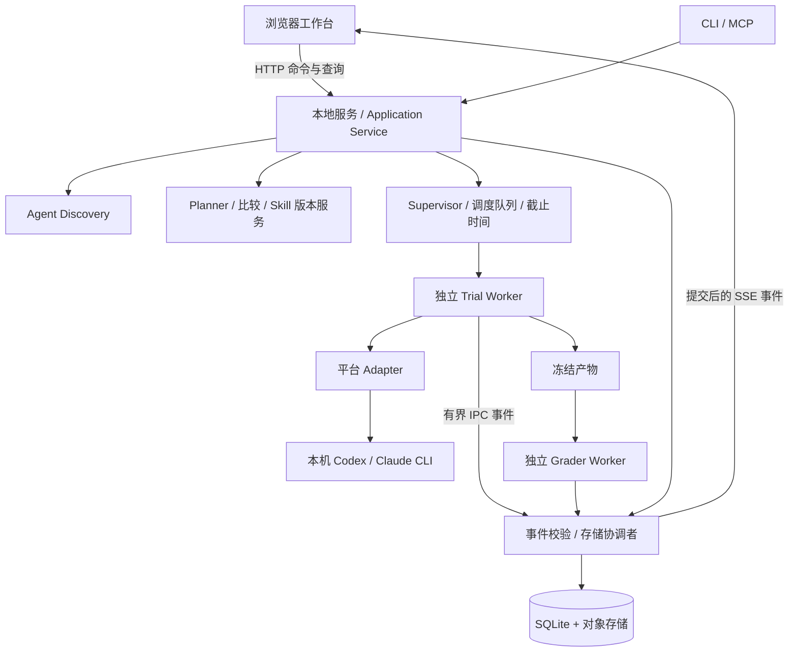

# 本地可视化 Skill 评测工作台架构

状态：实施中的目标架构，2026-09-16；工作台、Agent 探测、Skill/Suite 不可变资产、评测计划冻结，W2 的 Adapter 运行/事件/取消与结果详情，以及 W3 的首个历史运行对比切片已实现。真实账号一致性验证、统一工具事件和完整发布/回滚体验仍按本文推进。本文基于当前 v0.1 代码及用户的六项需求：本地启动网页、发现并复用本机 Agent、启动目录作为工作区、执行过程可视化、结果保存对比、Skill 版本管理。

本文更新产品入口和工程交付方向；评测约束继续遵循[评测协议](evaluation-protocol.md)。旧版[架构](architecture.md)保留历史背景；涉及新领域对象、事件和接口时，以本文的设计为下一阶段实现依据，落地时同步更新[契约](contracts.md)。

## 1. 产品定位与设计决策

产品面向已有 Skill 的作者和维护者。用户在本机打开工作台，导入 Skill 和测试任务，调用已经安装的 Agent，观察过程，再判断 Skill 是否有效、哪个版本更好以及是否存在回归。

| 用户需求 | 设计决策 | 用户可见行为 |
| --- | --- | --- |
| 本地启动后打开 HTML 网页 | 本地 HTTP 服务提供 Web 应用，自动打开系统默认浏览器 | 启动一次，后续操作在网页完成 |
| 发现并复用本机 Agent | Discovery + 平台 Adapter，固定本机可执行文件绝对路径 | 展示安装、认证和能力状态；优先选用可用的 Codex |
| 工作目录就是启动目录 | 一个服务实例绑定一个 Workspace，所有项目数据位于该目录下 | 页头持续展示工作区；可从其他目录导入 Skill |
| 测试流程可视化 | 运行时采集结构化事件，持久化后实时推送 | 看到当前任务、工具调用、产物、耗时和失败原因 |
| 保存和对比结果 | 自动保存 Run；比较配置、逐题结果和版本变化 | 刷新或重启后仍能查历史；选择两次运行进行比较 |
| Skill 版本管理 | 稳定 Skill 身份 + 不可变版本快照 + 发布指针 | 导入新版本、查看 diff、关联测评、导出和回滚 |

首版使用 React + TypeScript + Vite 构建前端，Node 本地服务承载 API、调度和存储。开发入口 `npm run dev` 与 `skillbenchmark ui` 已实现，支持 `--workspace`、`--port`、`--no-open`；当前已接通工作区、Agent 探测、Skill/Suite/计划，以及 Run 启动、增量事件查询、结果持久化、取消、结果详情和两次已完成运行的比较。计划冻结不会调用 Agent，只有显式启动 Run 才执行；当前详情复用完整报告和有界事件窗口，对比复用两份持久化报告并将 Run ID 保存到 URL。游标补流仍按后续切片实现。

本地服务和数据存储不要求云账号；实际调用 Codex/Claude Code 时，模型请求仍由对应 CLI 发往其已配置的服务，遵循本机账号和额度。使用本机 CLI 不等于模型离线运行。

首版交付范围是本机单用户工作台。云调度、多人协作、公开排行榜、全自动优化和桌面安装包放在后续阶段。MCP/插件和现有 CLI 保留为同一应用服务的其他入口。

## 2. 页面与用户操作

导航控制在六个一级入口；版本管理属于 Skill 详情，避免用户在多个模块间拼接同一条工作流。

| 页面 | 核心内容 | 主要操作 |
| --- | --- | --- |
| 工作台 | 当前目录、默认 Agent、正在运行、最近结果、首次使用引导 | 导入 Skill、新建评测、继续查看运行 |
| Skills | Skill 列表、说明、来源；详情内含版本、文件 diff、关联实验 | 从路径/文件夹导入、创建草稿、保存新版本、导出 |
| 测试集 | 任务输入、附件、评分规则、任务分组、版本 | 导入、手工创建、校验、冻结版本 |
| 实验 | 草稿、运行队列、运行详情、历史筛选 | 配置、启动、停止调度、取消、重跑 |
| 对比 | 版本/Run 选择、可比性检查、差异矩阵、回归题目 | 比较、定位证据、保存比较报告 |
| 本机 Agent 与设置 | 可执行文件、版本、连接状态、默认模型、并发和目录策略 | 重新检测、手动指定路径、验证连接 |

首次流程：进入首页 → 自动发现 Agent → 导入一个 Skill → 选择现有测试集或创建几道测试题 → 确认实验计划 → 运行 → 查看报告。没有 Agent 时允许浏览、导入和体验明确标记的 demo；开始真实运行时提示缺失的运行条件。

导入支持粘贴本机目录路径，并提供浏览器文件夹上传作为替代。浏览器的文件夹选择不保证返回本机绝对路径，上传模式以相对路径和文件内容建立快照，来源显示“文件夹上传”。目录导入则由本地服务解析显式路径。网页无须获得任意文件系统浏览能力。

新建实验采用四步表单：

1. **测什么**：Skill 与版本；选择“试跑”“有效性对照”或“版本对照”。
2. **用什么测**：测试集版本、任务范围、评分规则；预览输入及应生成的产物。
3. **由谁执行**：默认 Codex，可切换 Claude Code；明确模型配置、每题超时、重复次数和并发。
4. **确认计划**：展示条件 × 任务 × Agent × 重复次数的总量、最大尝试次数和整体时间上限，然后启动。

“试跑”允许只测一个版本，检查是否能完成任务；“有效性对照”比较无目标 Skill 与指定版本；“版本对照”比较两个真实版本，可选加无 Skill 基线。没有候选版本时不生成空的 candidate 条件。只有任务描述、没有可靠评分规则时，结果显示为“执行记录/待人工评审”，不制造成功率。

测试集第一版支持文本/JSON 断言，以及固定脚本对文件产物评分；其他领域通过同一 Grader 接口扩展。AI 辅助出题是后续入口，生成后必须经过检查并冻结评分依据。

运行详情采用任务列表、时间线、证据详情三栏：

```text
工作区：my-project    实验：Skill v1 → v2    Agent：Codex
已完成 12/24   运行 1   待运行 11   已耗时 08:42   [停止调度] [取消运行]
┌─────────────────┬────────────────────────────┬────────────────────┐
│ task-01 / v1 ✓  │ 00:00 准备执行副本          │ 选中事件详情       │
│ task-01 / v2 ✓  │ 00:01 放置 Skill           │ 工具：Bash         │
│ task-02 / v1 ✗  │ 00:02 Agent 开始           │ 命令、退出码       │
│ task-02 / v2 ▶  │ 00:04 文件读取             │ 输出摘要 / 展开    │
│ …               │ 00:06 工具调用 → 完成      │ 文件差异           │
│ 条件/状态筛选   │ 00:31 产物冻结 → 评分      │ 证据与评分断言     │
└─────────────────┴────────────────────────────┴────────────────────┘
```

上述时间和数量仅为界面示意。总耗时由服务计算；进度按已终结的 Trial 数计算，不把进度百分比当作剩余时间预测。任务失败、基础设施故障、主动取消分别呈现。

## 3. Workspace 与执行目录

启动时冻结 `workspace_root`，以用户启动目录为默认值；显式 `--workspace` 优先。通过 npm 启动时处理 `INIT_CWD`，避免脚本切换目录后错误地使用工具源码目录。后续导入、报告和配置均归属这个 Workspace。服务不通过全局 `process.chdir()` 切换并发任务目录。

Workspace 是项目和评测资产的归属；Trial 的 `execution_cwd` 是 Agent 本次操作文件的目录。默认从选定的项目文件或测试 fixture 建立冻结快照，再为每个 Trial 创建独立副本；网页明确展示来源目录及实际执行目录。

```text
<启动目录>/
├── 项目文件…
└── .skillbenchmark/
    ├── config.json                 # 本工作区配置，不含认证凭证
    ├── metadata.sqlite             # 工作区级索引、作业状态和事件
    ├── objects/sha256/             # 不可变 Skill/项目/Suite/产物对象
    ├── skills/<skill-id>/drafts/    # 可编辑草稿
    ├── runs/<run-id>/              # 冻结计划与可重建报告
    ├── exports/                   # 显式导出的报告或 Skill 包
    └── work/<attempt-id>/          # 一次尝试的执行副本
```

快照排除 `.skillbenchmark` 自身、版本控制内部目录、凭证和未选中的评分资料，避免递归复制和答案泄漏。依赖目录按 Suite 的依赖策略重建或引用经验证的缓存。创建快照时记录文件选择规则与真实字节摘要；未提交和未跟踪文件是否纳入由计划明确，不只记录 Git HEAD。运行期间的源文件变化不修改已冻结实验。

导入 Skill 先预览文件清单、大小、符号链接和脚本；复制到暂存区后重新校验快照，再提交对象。设置文件数量和总字节上限，拒绝越界链接；导入不执行包内脚本。原始目录更新后，通过“导入新版本”再次取快照。

提供两个执行层级：

- **本机评测**：复用已安装 CLI 和其正常认证路径，独立执行副本，用于日常诊断。当前用户权限下的目录副本不等于文件系统隔离，报告保留 `exploratory` 及背景配置可见性。
- **受控评测**：后续采用验证过的沙箱/容器/VM，限制可访问目录、网络和背景配置，隐藏评分材料仅评分 Worker 可见。满足对应一致性要求后才允许正式效果声明；不能将宿主 CLI 的路径直接当作容器内可运行二进制。

“直接使用原目录”可作为后续高级诊断选项，只允许串行运行并显式记录文件变化；首版对照实验使用副本，保持每个条件的起点一致。导入快照、试跑产物与日常使用的 Skill 分开保存。

## 4. 进程架构与责任边界



Supervisor 留在本地服务进程；Agent 输出解析、目录遍历/复制、文件 diff 和评分等可能繁忙的工作放到独立 Worker。每个 Worker 有独立的尝试身份和截止时间。一个 Worker 同步死循环时，服务仍能刷新网页并终止它；不能只依赖 Worker 自己的 `setTimeout`。

| 模块 | 负责 | 边界 |
| --- | --- | --- |
| Web | 表单、实时视图、比较和 diff | 不直接执行命令，不自行判定通过 |
| Application Service | 工作区用例、输入校验、幂等提交、状态变更 | HTTP/CLI/MCP 复用同一组操作 |
| Discovery | 定位 CLI、读取版本、能力和连接诊断 | 不安装软件，不批量读凭证 |
| Planner | 冻结条件、版本、任务、环境和预算，展开 Trial | 不在运行时更换测试定义 |
| Supervisor | 队列、全局并发、重试、取消、硬期限与进程归属 | 对真实 Worker 生存期负责 |
| Trial Worker / Adapter | 准备环境、运行 CLI、增量解析事件、收集产物 | 不访问隐藏评分资料或写发布指针 |
| Grader Worker | 按冻结规则评价产物 | 不依据 Agent 的“已完成”自述判成功 |
| Storage / Event Store | 事务、唯一约束、对象校验、日志与事件游标 | 单写入协调；浏览器只读提交后的证据 |
| Comparison / Registry | 检查可比性、计算差异、管理版本与发布收据 | 不覆盖原始结果，不自动安装到日常目录 |

HTTP 请求提交运行后立即返回 Run ID；关闭网页不取消运行。首版服务与启动终端生命周期一致，退出服务时停止调度并清理受管任务；不承诺关闭终端后仍运行。重新打开网页查询同一服务和工作区。相同工作区再次启动时复用已有实例，避免两个调度器竞争同一数据库。

## 5. Agent 探测和本机认证

平台 Adapter 提供静态探测规则；Discovery 按“显式配置路径 → 启动环境 PATH → 已知安装位置”定位可执行文件。不递归扫描整个磁盘，不启动交互 shell 加载任意配置。多个安装可并列展示，用户选择结果写入工作区；每次实验固定所选绝对路径、版本和 Adapter 版本。

探测采用低并发、有时限的 `--version`/能力检查，缓存结果并支持手动刷新。安装存在、认证和运行资格分别记录，不能用一次 `--version` 成功替代所有状态：

| 字段 | 值示例 | 意义 |
| --- | --- | --- |
| installation | missing / found / broken | 是否找到且能启动 |
| authentication | unknown / ready / required / failed | 由平台受支持状态接口或连接测试提供证据 |
| capabilities | events、usage、tool_details、cancel、approval 等及验证状态 | 可选能力逐项报告 |
| evaluation_support | exploratory / verified / unsupported | 当前环境下评测可信度 |
| provenance | path、version、detected_at、evidence | 支持诊断和运行复现 |

默认优先级：用户保存的选择 → 可用 Codex → 可用 Claude Code → 尚未验证的已安装 Agent。未验证项可预选但必须展示状态；没有可用 Agent 时保留完整工作台，提供配置入口。运行中不可静默从 Codex 切到 Claude，也不可自动更换模型。

复用本机 CLI 的正常登录与配置机制，认证秘密不进入工作区数据库、浏览器或 RunPlan。认证检查优先使用无模型调用的受支持命令；需要实际请求才能确定时，归入“验证连接”或用户启动的运行。前端不要求把 CLI 登录令牌重新粘贴成 API key。

模型“跟随本机默认”是便捷选项；工作台现已允许在冻结计划时选择 `default` 或填写目标 Agent 支持的模型 ID，并将请求模型写入 RunnerProfile、配置摘要和比较指纹。执行收据仍应记录平台报告的实际模型、配置和版本；当前平台未回报实际模型时标记 unknown，缺失身份的历史运行不能认定为严格可比。复用账号与继承所有背景 Skill/记忆不是同一件事，继承范围纳入执行 Profile；以能力检查选择隔离选项，不强加会破坏本机认证的统一 flags。

第一阶段支持 Codex，第二个真实平台为 Claude Code；其他 Agent 使用相同插件式 Adapter 接口，未适配平台显示“已发现/尚不支持评测”而不是显示“可运行”。

## 6. 核心实验与版本模型

核心设计围绕“Skill 版本对 Agent 完成任务的影响”，不用通用会话记录代替评测证据。

| 对象 | 身份与关系 |
| --- | --- |
| Workspace | 稳定 ID + 启动根目录，承载资产和运行历史 |
| Skill | 稳定逻辑 ID、名称和来源；不能用内容摘要充当跨版本身份 |
| SkillVersion | version_id、skill_id、parent_version_id、tree_digest、说明；内容不可变 |
| SuiteVersion | 任务清单、公开 fixture、评分材料引用、split 与评分政策摘要 |
| ProjectSnapshot | 测试起点的内容摘要和文件选择规则 |
| AgentInstallation / RunnerProfile | 本机安装与冻结的实验平台配置分别建模 |
| ExperimentDraft / RunPlan | 可编辑草稿与不可变实验计划分别建模 |
| Condition | condition_id + skill_version_id 或 null；绑定到具体内容摘要 |
| Run / Trial / Attempt | 一次实验；矩阵中的计划项；该项的实际尝试 |
| Event / Artifact / Grade | 过程证据、冻结产物及独立评分 |
| Comparison / Decision | 比较范围、可比性结果、统计与准入结论 |
| Release / ExportReceipt | 被发布的确切版本及单独的导出结果 |

条件必须显式绑定，例如 `none → null`、`incumbent → v1@digest-A`、`candidate → v2@digest-B`；Worker 按条件取对应快照，不能只传一个全局 `skill_dir`。计划预览允许同摘要诊断，但不把重复测试同一份内容称为版本升级实验。

主链路：冻结计划 → 排队 → 准备副本 → 放置对应 Skill → 启动 Agent → 增量记录事件 → 冻结最终输出、文件产物及 diff → 独立评分 → 汇总比较 → 清理临时环境。产物采集成功和摘要持久化之后才能删除工作目录。

评分状态和进程状态分别保存：进程正常结束可能评分失败；网络故障可能无法评分。模型/工具超时通常计任务失败；基础设施错误按计划有限重试，不能把失败答案重跑到成功再择优。手动重跑生成新的 Run 或明确的后续尝试记录，旧结果保持可查。

版本管理采用三个独立维度：内容版本、评测证据、发布状态。v2 在某个 Suite/Codex 配置通过，不等于对所有测试和 Agent“已验证”。页面徽标从关联的 Decision 派生，并显示适用范围。

编辑先创建可变草稿；保存产生不可变新版本和父版本链接。新导入的相同字节复用底层对象，来源记录可追加。发布要求 Decision 绑定候选摘要、Suite、Profile、政策和证据，不能仅接受任意 `gate.json` 中的 `accept`。本机探索结果可归档、导出；正式验证发布需满足隔离与审计政策。回滚追加发布指针变化，不删除版本、历史 Run 或评价。

## 7. 实时可视化与事件协议

实时管线采用：CLI stdout/stderr → 有界流式解码 → 平台 Adapter → 统一事件 → 持久化 → SSE → 网页。现有执行结束后整体解析 stdout 的方式需要替换。JSONL 解析必须正确处理半行、跨字节字符、超长单行和未知事件。

HTTP 处理命令，SSE 推送事件；初期不需要双向 WebSocket。工具授权若平台支持交互协议，通过单独的 HTTP 操作返回；不支持交互时在计划中采用确定性允许/拒绝策略，并显示权限拒绝，避免前端出现无法实际执行的“批准”按钮。

事件最少包含 `schema_version`、`event_id`、`run_id`、`trial_id`、`attempt_id`、`run_seq`、`kind`、`producer`、`observed_at`、可选 `source_timestamp`、`span_id`、`parent_span_id` 和 `payload_ref`。`run_seq` 由存储协调者分配，重试使用新 attempt，避免事件序号互相覆盖。

| 事件族 | 展示与意义 |
| --- | --- |
| run / trial / attempt | 排队、启动、终态、停止原因与重试关系 |
| environment / skill | 准备、文件放置、实际加载证据；放置不等于加载 |
| agent / message | 会话元数据、可公开消息与最终输出 |
| tool | 调用 ID、工具名、参数摘要、开始/结束、退出码和输出引用 |
| artifact / grader | 文件产物、diff、评分断言和证据 |
| usage / diagnostic | 平台报告用量、限制、协议解析错误、观测缺失 |

UI 展示工具树与时间线，平台事件缺失时明确标为未知，不通过模型文本猜测工具执行。“未发现工具事件”不直接显示为“工具调用 0 次”，同时显示观测覆盖状态。不保存隐藏推理；脱敏在事件/输出写盘前完成。

耗时使用单调时钟计算，UTC 用于跨记录排序；区分排队、准备、Agent、评分、清理和 Run 墙钟时间。工具耗时属于 Agent 阶段，多个工具并行时展示区间，不把它们相加冒充总耗时。只有接收时间时标注测量口径。费用分为平台估算、已报告用量和未知，订阅调用不直接写成现金费用为零。

服务先提交事件再向 UI 广播。初始快照附带游标，SSE 从该游标补读；重连用 Last-Event-ID，重复事件按 ID 去重。浏览器变慢不能阻塞 Agent：推送队列有界，落后时断开并让客户端从事件库恢复。事件库写入失败则停止任务并记录运行故障，不默默丢掉证据。大量文本单独入对象存储，页面分页/虚拟列表读取；总日志字节与事件数均有上限，超限有明确终态。

## 8. 保存、比较和报告

计划在启动前保存，事件在执行中保存，产物和评分在完成时保存；“保存结果”默认自动完成，用户操作用于命名、标签和导出。HTML/Markdown 是可重建的视图，SQLite 和对象存储承载证据。历史页面能重放事件展示，但重放不会重新调用 Agent。

比较提供两个视图：同一实验的条件对照，以及两个历史 Run 的并排查看。比较入口先解释哪些条件相同、哪些不同，再计算可解释的指标。

当前历史对比已按 `task_id | profile_id | condition_id | repeat_index` 配对已完成 Trial，展示逐题状态转移、条件成功率与墙钟变化。它会检查 Suite 摘要、Agent、请求模型、Runner 配置摘要、条件、重复次数、预算、执行模式与加载方式。这些完全对齐且候选 Skill 摘要变化时标记为 Skill 效果比较；Skill 摘要也相同时标记为重复性比较；其他情况仅描述差异。当前结果是可重建 UI，尚未增加独立的持久化跨 Run Comparison 资源。

- **严格对照**：任务及 split、项目起点、Grader、平台/模型、公共配置、环境、加载方式、背景 Skill、预算和统计政策一致，允许目标 Skill 摘要变化；按任务和重复编号配对。
- **描述性比较**：Agent、任务、模型或配置不同，仍可并排看结果、耗时与证据，但标明差异，不称作某个 Skill 版本导致的提升。
- **证据不足**：身份未知、日志缺失或矩阵不完整，保留已有结果并给出原因，准入结论为 inconclusive 或按固定政策拒绝。

`plan_digest` 覆盖完整计划（包含条件与版本）；`comparison_fingerprint` 排除目标 Skill 干预和 Run ID，包含其余影响可比性的因素，按 Profile 生成。二者不能共用一个哈希。试跑与正式重复评测不能无提示混用；历史基线复用需预先定义有效期/实验窗口，避免服务端模型漂移掩盖差异。

报告优先显示通过/失败/无法评分数量、有效分母、改善与回归题目、配对差值、耗时与观测覆盖率。统计按任务或来源族聚类，不把基础设施重试当独立样本。低样本展示区间与 inconclusive；最少显示任务数、重复次数、缺失率。

导出报告包包含计划、版本/任务/环境摘要、事件、产物、评分和比较配置，默认省略秘密及无关本机路径。发布、HTML 报告导出与 Skill 包导出是独立动作，用户能明确看到导出目标。

## 9. 运行监督与恢复

针对已有长时间高 CPU 测试问题，监督机制需要成为架构组成部分：

1. Supervisor 持有整个 Run 的截止时间；准备、Agent、产物采集、评分与清理各有独立时限，总预算不会被阶段重置。
2. Worker 和受管 CLI 登记 run/attempt、进程组、启动身份和所有权；取消范围仅限所属任务。取消某个 Run 不得清理其他并发 Run。
3. 正常终止采用有限宽限期，随后强制终止；只有完成清理或明确记录 `cleanup_failed` 才发布取消终态。POSIX 进程组与 Windows Job Object 等按平台验证，进程树快照只作为补充。脱离父进程的未知后台任务不能声称一定可回收；强隔离依赖验证过的 OS/容器边界。
4. Worker 心跳用于发现无响应，低 CPU/长时间无工具事件不等于挂死；达到硬截止时间必须结束。CPU/内存图表可作为后续诊断，默认并发 1，用户可调整上限。
5. 重启时将失去归属的运行标记 interrupted，核对进程启动身份后再处理受管残留，不能凭可能复用的 PID 杀进程。
6. 恢复保留已完成 Trial；不确定是否完成的模型调用记录 unknown 和可能用量，恢复动作创建新的 attempt，不承诺调用只发生一次。

“停止调度”让当前任务完成，余下任务留在队列；“取消运行”终止当前任务并取消队列。首版不冻结运行中的模型进程，不将暂停按钮伪装为可以无损恢复会话。

## 10. 本地服务与 API

本地服务只监听 loopback，静态网页与 API 同源。启动生成短期会话凭据，通过一次性浏览器引导交换，不记录在实验日志；检查 Host/Origin 和写操作凭据，避免任意网页调用本机执行接口。开发服务器通过受限代理访问后端，不开启全域 CORS。

文件接口以 Workspace 对象 ID 为主；外部源路径只进入显式导入/导出操作，验证真实路径与目录范围。来自 Agent 的 HTML/Markdown 和脚本输出作为不可信内容渲染，HTML 产物在受限预览中展示。支持终端控制字过滤和大输出分页。

下列为拟定 `/api/v1` 操作，不代表现有服务已提供：

| 操作 | 路由示例 | 行为 |
| --- | --- | --- |
| 工作区与 Agent | `GET /workspace`、`GET /agents`、`POST /agents/refresh` | 获取当前上下文及重新探测 |
| 验证连接 | `POST /agents/:id/verify` | 创建有界验证作业，返回 job ID |
| 导入资产 | `POST /skills/import`、`POST /suites/import` | 校验、冻结并保存；大导入返回 job ID |
| 查询/草稿/版本 | `GET /skills/:id/versions`、`POST /skills/:id/drafts`、`POST /skills/:id/versions` | 版本历史、草稿与新快照 |
| 创建计划 | `POST /plans` | 返回冻结矩阵、预算和运行诊断 |
| 提交运行 | `POST /runs` | plan ID + 幂等键；返回 202 与 Run ID |
| 历史与详情 | `GET /runs`、`GET /runs/:id`、`GET /runs/:id/trials` | 分页查询，详情附事件游标 |
| 运行控制 | `POST /runs/:id/cancel`、`POST /runs/:id/pause`、`POST /runs/:id/resume` | cancel 中止；pause 只停止继续调度 |
| 过程事件 | `GET /runs/:id/events?after=...`、`GET /runs/:id/stream` | 历史分页和 SSE 实时补流 |
| 证据对象 | `GET /artifacts/:id` | 校验对象归属、分页或下载 |
| 比较 | `POST /comparisons` | 返回可比性诊断、指标与证据引用 |
| 发布/导出 | `POST /releases`、`POST /exports`、`POST /releases/rollback` | 校验证据绑定、发布指针及导出目标 |

相同幂等键和计划返回原 Run；相同键对应不同内容返回冲突。Run 状态变更使用版本号避免重复点击/并发标签页覆盖。请求不能直接传入任意 shell 字符串作为系统级执行命令，Adapter 使用结构化参数启动已选定的 CLI。

## 11. 存储与代码组织

SQLite 采用版本化迁移，使用 Workspace 级数据库和单写入协调。新增或扩展 workspaces、skills、skill_versions、suite_versions、project_snapshots、agent_installations、runner_profiles、plans、runs、trials、attempts、events、artifacts、grades、comparisons、decisions、releases、exports。

关键约束：Trial 唯一键包含 run/task/profile/condition/repeat；Attempt 以 trial/attempt_index 唯一；Event 以 run/run_seq 唯一，并保存源事件去重标识；Grade 绑定 attempt、产物摘要和 grader 摘要；发布指针按 skill 与适用范围区分。发布操作使用 expected_current_version 乐观锁，替代整个工作区只有一个 current 指针的限制。

对象先写临时文件、校验摘要、原子落盘，再在数据库事务内登记引用、事件和状态。崩溃可留下未引用对象，后续整理；对象缺失/损坏则显示证据不完整。每个 Trial 的最终评分、终态和事件提交保持一致；不跨文件系统与数据库宣称原子事务。

迁移旧数据时先备份、保留 schema_version 和来源；旧 stdout 记录不能补造工具开始/结束时间，旧计划缺少 Skill 绑定或配置时不能补写为“已验证”。旧 CLI 路径通过应用服务兼容或作为明确的 legacy 导入；不让两个调度器同时直接写同一工作区。

建议代码布局按实际实现逐步增加：

```text
apps/
  cli/                    # 启动工作台及脚本入口
  web/                    # React 页面、状态查询、时间线与 diff
  local-server/           # HTTP、SSE、会话、工作区实例管理
  worker/                 # Trial/Grader Worker 进程入口
  mcp-server/             # 调用同一应用服务
packages/
  contracts/              # 版本化领域模型、事件与 API 校验
  core/                   # 继续容纳领域与本地基础设施，按责任分目录
    application/          # 用例编排
    agents/               # Discovery、平台 Adapter、协议解析
    runtime/              # Supervisor、队列、执行环境、受管进程
    evaluation/           # Suite、Grader、比较、统计
    skills/               # 导入、快照、草稿、版本与发布
    storage/              # SQLite、迁移、事件与对象存储
```

首版无需把每个模块拆成独立 npm 包。领域层不依赖 React、HTTP 和平台事件格式；Adapter 负责差异转换。网页由服务打包提供，使用者不需要分别启动前后端；开发入口协调前端构建/热更新与后端，退出时收拢相关进程。

## 12. 现有实现到新架构的差距

以下根据当前代码核对，不能以已有函数名代替完成度：

| 当前实现 | 新架构的必要改造 |
| --- | --- |
| CLI/MCP 直接编排流程，只有静态报告 | 抽出应用服务；增加本地 API 和工作台 |
| Adapter probe 主要运行 `--version` | 分离安装发现、认证状态、实际能力验证 |
| `run-adapter` 只有一个 `skillDir`，Scheduler 全条件共用 | 引入 condition → SkillVersion 映射，真实比较 v1/v2 |
| `runSubprocess` 返回后 Adapter 才解析 stdout | 增量解码、标准工具事件、执行中入库与 SSE |
| 执行日志集中在最终 `saveResult` 中保存 | 持续事件持久化；新增 Run/Attempt 状态和恢复游标 |
| LocalEnvironmentBackend 仅准备临时目录与输入/Skill | 加入当前项目/fixture 快照、每次恢复一致起点 |
| collect 返回路径，随后 destroy 删除目录 | 先保存文件产物、diff 与摘要，再清理 |
| Scheduler 直接调用 exact-match，外部 Grader 是独立函数 | Grader 注册与冻结配置，接入独立评分 Worker |
| trials 唯一约束缺 profile，重试结果覆盖同 trial | 迁移唯一键并分离 Trial 和 Attempt |
| Skill 快照身份随内容改变；Registry 是全局 current 指针 | 稳定 Skill ID、不可变版本及每个 Skill 的发布指针 |
| `evolve` 使用 mock，候选追加固定指导段落 | 保留明确的演示能力；真实分析/修改/再评测在后续接入 |
| 已有超时、输出上限与进程树清理工具 | 复用并扩展为每 Run 所属进程管理、取消、独立监督与平台一致性测试 |

## 13. 开源借鉴边界

沿用上一轮调研，将外部项目定位为外围实现参考。借鉴内容与许可、版本、适配成本需要在实际引入时核验，本文不声称已经复用其代码。

| 参考 | 可研究的通用机制 | 我们自己负责的核心 |
| --- | --- | --- |
| [Promptfoo](https://github.com/promptfoo/promptfoo) | 本地 CLI/Web 入口、评测结果查看与导出 | Skill 条件绑定、比较身份与版本证据 |
| [Inspect 日志](https://inspect.aisi.org.uk/eval-logs.html) | 任务日志和过程查看 | 统一事件到各平台工具能力的映射 |
| [OpenHands](https://docs.openhands.dev/openhands/usage/cli/quick-start) | 本地 CLI/Web/Headless 入口组织 | 围绕测评的产品流程，而非通用聊天会话 |
| [twaldin/harness](https://github.com/twaldin/harness) | 多 CLI 调用与 Adapter 边界的研究对象 | 实验矩阵、评分政策和可比性判断 |
| [ACP Registry](https://github.com/agentclientprotocol/registry) | Agent 元数据与能力描述 | 本机安装探测和逐版本验证；注册表条目不证明本机已安装 |

优先顺序是官方协议/稳定 CLI → 自己的薄 Adapter → 必要时引入许可兼容且维护可接受的组件。开源 Agent 启动器的自动下载能力不属于首版默认行为；复用本机 CLI 的路径和认证语义必须保持明确。代码复用时记录来源、commit、许可证和修改范围；不复制其产品数据模型作为自己的评测内核。

## 14. 实施顺序与验收

| 阶段 | 交付 | 验收标准 |
| --- | --- | --- |
| W1：工作台与资产 | 一键启动网页、当前目录、本机 Agent 卡片、Skill/测试集导入、版本快照 | 从两个不同目录启动时分别归属各自 Workspace；导入源不变；Codex 缺失可正常进入页面 |
| W2：单平台真实闭环 | Codex、独立副本、流式事件、评分、自动保存、取消 | CLI 完成前页面已显示事件；刷新可补流；不同条件实际读取不同版本；文件产物可追溯 |
| W3：对比与版本管理 | 真实 v1/v2 对照、历史比较、diff、发布证据、导出/回滚 | 配置不同可并排看但不能当作严格增益；回滚不丢失历史；重启后结果和版本仍可查 |
| W4：第二平台与能力一致性 | Claude Code 复用本机登录、统一事件、Profile 分层对比 | 两个平台分别通过启动、输出、超时、取消、能力缺失和配置收据验证 |
| W5：后续增强 | 受控隔离 Worker、真实候选生成、复杂 Suite、其他 Agent | 按各自独立验收条件交付，不提前把 mock 结果当作真实效果 |

W1–W4 合起来覆盖用户本轮六项需求。W2 先形成可用的单平台路径，W3/W4 补齐历史比较、版本与双平台体验。真实 Agent 测试应采用明确的小型 Suite 和预算，工程测试使用可控 fake CLI 覆盖异常路径；两类证据分别记录。

优先验证的异常场景：Worker 同步忙循环、CLI 忽略终止信号、派生后台进程、输出洪泛、浏览器断连、数据库/磁盘写入失败、重复启动服务、两个 Run 同时取消其中一个、运行中服务退出、Skill 源目录变化。验收要求服务仍可响应、运行在预算内终止、历史证据不伪造，清理失败可见。

交付界面示例数据必须标记 demo。W1 的工作台/Agent 探测、Skill 资产、Suite 资产与评测计划，W2 的 Adapter 运行监控和结果详情，以及 W3 的历史运行对比首切片已改变程序行为并通过自动化与浏览器验收；详情区分 Run 墙钟与 Trial 累计耗时，对比在配置不一致时降级为描述性观察，并将平台未报告的信息保留为 unknown。fake CLI 结果只证明工程链路，真实平台效果仍须单独验证。
